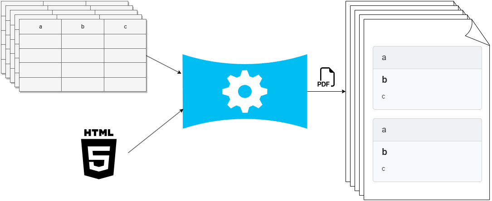
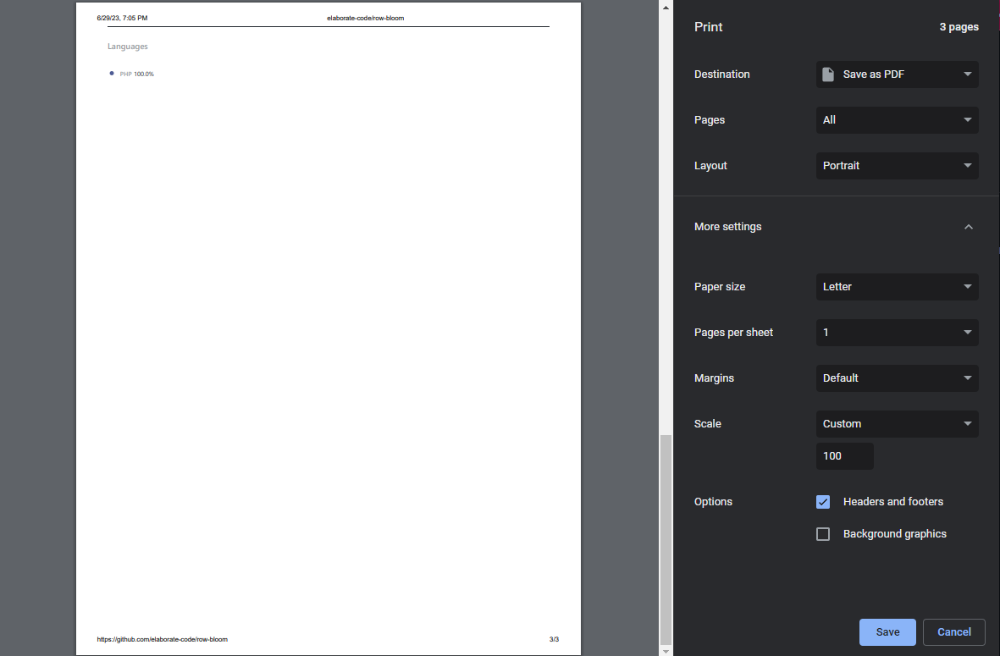

# Row bloom

[](https://packagist.org/packages/row-bloom/row-bloom)
[](https://github.com/row-bloom/row-bloom/actions?query=workflow%3Arun-tests+branch%3Amain)
[](https://github.com/row-bloom/row-bloom/actions?query=workflow%3A"Fix+PHP+code+style+issues"+branch%3Amain)
[](https://packagist.org/packages/row-bloom/row-bloom)

This package is used to generate PDFs using a table of data with one or many rows, and a template that gets applied for each row.

The goal is to allow the usage of any templating engine with any PDF generation library, by abstracting them as drivers and trying to ensure an idempotent output no matter what driver the user picks.



## Setup

```bash
composer require row-bloom/row-bloom
```

Call at the entry point of your application:

```php
use RowBloom\RowBloom\RowBloomServiceProvider;

app()->make(RowBloomServiceProvider::class)->register();
app()->make(RowBloomServiceProvider::class)->boot();
```

Requires:

- PHP >= 8.1

## Usage

```php
use RowBloom\ChromePhpRenderer\ChromePhpRenderer;
use RowBloom\RowBloom\Interpolators\PhpInterpolator;
use RowBloom\RowBloom\Renderers\Sizing\PaperFormat;
use RowBloom\RowBloom\RowBloom;
use RowBloom\RowBloom\Types\Table;

app()->get(RowBloom::class)
    ->addTable([
        ['title' => 'Title1', 'body' => 'body1'],
        ['title' => 'Title2', 'body' => 'body2'],
    ])
    ->addTable(Table::fromArray([
        ['title' => 'Title3', 'body' => 'body3'],
        ['title' => 'Title4', 'body' => 'body4'],
    ]))
    ->setInterpolator(PhpInterpolator::class)
    ->setTemplate('
        <h1><?= $title ?></h1>
        <p>Bold text</p>
        <div><?= $body ?></div>
    ')
    // ---------------------------
    ->setOption('perPage', 2)
    ->setOption('landscape', false)
    ->setOption('format', PaperFormat::FORMAT_A4)
    ->setOption('displayHeaderFooter', true)
    ->addCss('
        p {font-weight: bold;}
    ')
    ->addCss('
        div {color: red;}
    ')
    // ---------------------------
    // ->setRenderer('mPDF')
    // ->setOption('margin', '25.4 mm')
    // ->setOption('rawHeader', '{DATE j-m-Y}|center|right')
    // ->setOption('rawFooter', 'left|center|{PAGENO}/{nb}')
    // ---------------------------
    ->setRenderer(ChromePhpRenderer::class)
    ->setOption('margin', '1 in')
    ->setOption('rawHeader', '
        <div class="header" style="font-size:10px">
            <span class="date"></span>
            <span class="title"></span>
        </div>
    ')
    ->setOption('rawFooter', '
        <div class="footer" style="font-size:10px">
            <span class="pageNumber"></span> of <span class="totalPages"></span>
        </div>
    ')
    // ---------------------------
    ->save(__DIR__.'/foo.pdf');
```

After finishing the fluent build, the execution goes through three main steps:

1. Collect data.
2. Interpolate data into the given template and make the final HTML body.
3. Handle options and output the final HTML or PDF.

### Data

Provide data using `addTable` or `addTablePath` (A driver will be picked automatically for each table path).

Available drivers:

- [Spreadsheet](https://github.com/row-bloom/spreadsheet-data-loader).
- JSON.
- Folder.
- CSV (todo).
- Db (todo).

The officially supported file extensions are: `xlsx`, `xls`, `xml`, `ods`, `slk`, `gnumeric`, `html`, `csv`, `json`.

### Template

Pick a driver using `setInterpolator`, and provide a template with `setTemplate` or `setTemplatePath`.

The available interpolators are:

- PHP `RowBloom\RowBloom\Interpolators\PhpInterpolator`.
- [Twig](https://github.com/row-bloom/twig-interpolator).
- Blade (todo).

### Rendering

Pick a driver using `setRenderer`, and optionally provide css with `addCss` or `addCssPath`.

The available renderers are:

- [Chrome php](https://github.com/row-bloom/chrome-php-renderer).
- [mPDF](https://github.com/row-bloom/mpdf-renderer).
- [Browsershot](https://github.com/row-bloom/browsershot-renderer).
- HTML `RowBloom\RowBloom\Renderers\HtmlRenderer`.

### Options

Each renderer has its own way of handling **margin**, **header**, **footer**, **paper size**, and more. This package tries to act as a wrapper and give the same output from the same options regardless of the rendering library.

> The hard part XD

The main options are the ones offered by the browser print UI.



| Option                | type            | default  | Html | mPDF | Chrome php & Browsershot |
| --------------------- | --------------- | -------- | ---- | ---- | ------------------------ |
| `perPage`             | `int`           | `null`   | ✔️ | ✔️ | ✔️                     |
| `displayHeaderFooter` | `bool`          | `true`   | ❌   | ✔️ | ✔️                     |
| `rawHeader`           | `string`        | `null`   | ❌   | ✔️ | ✔️                     |
| `rawFooter`           | `string`        | `null`   | ❌   | ✔️ | ✔️                     |
| `printBackground`     | `bool`          | `false`  | ❌   | ❌   | ✔️                     |
| `preferCSSPageSize`   | `bool`          | `false`  | ❌   | ❌   | ✔️                     |
| `landscape`           | `bool`          | `false`  | ❌   | ✔️ | ✔️                     |
| `format`              | `PaperFormat`   | `null`   | ❌   | ✔️ | ✔️                     |
| `width`               | `string`        | `null`   | ❌   | ✔️ | ✔️                     |
| `height`              | `string`        | `null`   | ❌   | ✔️ | ✔️                     |
| `margin`              | `array\|string` | `'1 in'` | ❌   | ✔️ | ✔️                     |
| `metadataTitle`       | `string`        | `null`   | ❌   | ✔️ | ❌                       |
| `metadataAuthor`      | `string`        | `null`   | ❌   | ✔️ | ❌                       |
| `metadataCreator`     | `string`        | `null`   | ❌   | ✔️ | ❌                       |
| `metadataSubject`     | `string`        | `null`   | ❌   | ✔️ | ❌                       |
| `metadataKeywords`    | `string`        | `null`   | ❌   | ✔️ | ❌                       |
|                       |                 |          |      |      |                          |

### Support

When I was building an application to consume this library, I found it useful to get lists of what is supported by `RowBloom` as drivers, file extensions, and options per rendering driver... So here comes `RowBloom\RowBloom\Support` class.

```php
use RowBloom\RowBloom\Support;

/** @var Support */
$support = app()->get(Support::class);

$support->getDataLoaderDrivers();
$support->getInterpolatorDrivers();
$support->getRendererDrivers();

$support->getSupportedTableFileExtensions();

$support->getRendererOptionsSupport('driverName');

// ...
```

#### Registering additional drivers

After calling `app()->make(RowBloomServiceProvider::class)->register()` you can extend the capabilities of the library and register first party, third party, and custom drivers using:

- `Support::registerDataLoaderDriver` (must implement: `RowBloom\RowBloom\Drivers\DataLoaderContract`).
- `Support::registerInterpolatorDriver` (must implement: `RowBloom\RowBloom\Drivers\InterpolatorContract`).
- `Support::registerRendererDriver` (must implement: `RowBloom\RowBloom\Drivers\RendererContract`).

### Config

`RowBloom\RowBloom\Config` is currently used to store external binaries paths.

## Changelog

Please see [CHANGELOG](CHANGELOG.md) for more information on what has changed recently.

## Contributing

Please see [CONTRIBUTING](CONTRIBUTING.md) for details.


## License

The MIT License (MIT). Please see [License File](LICENSE.md) for more information.
